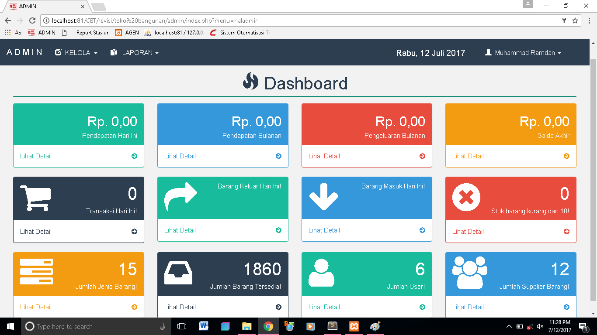
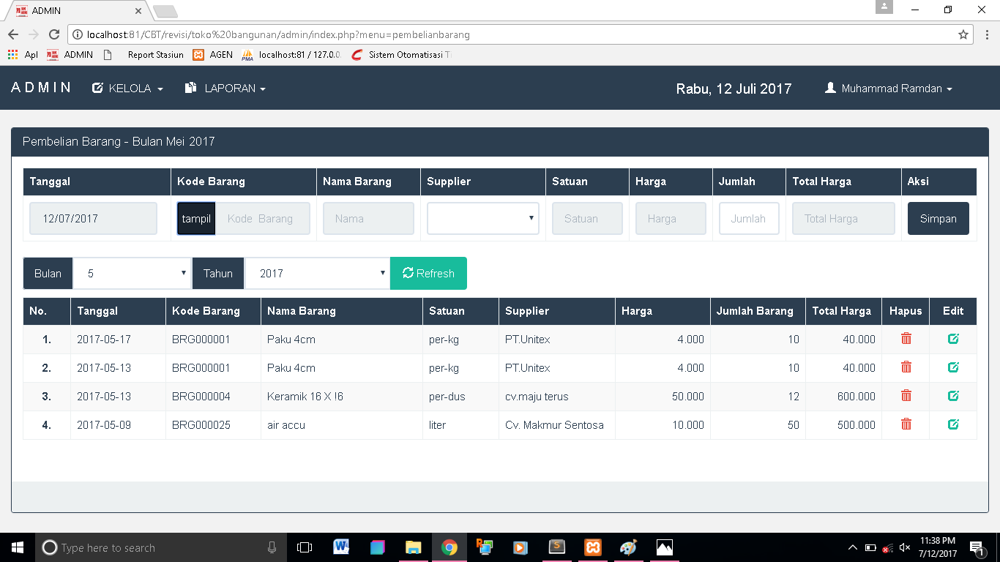
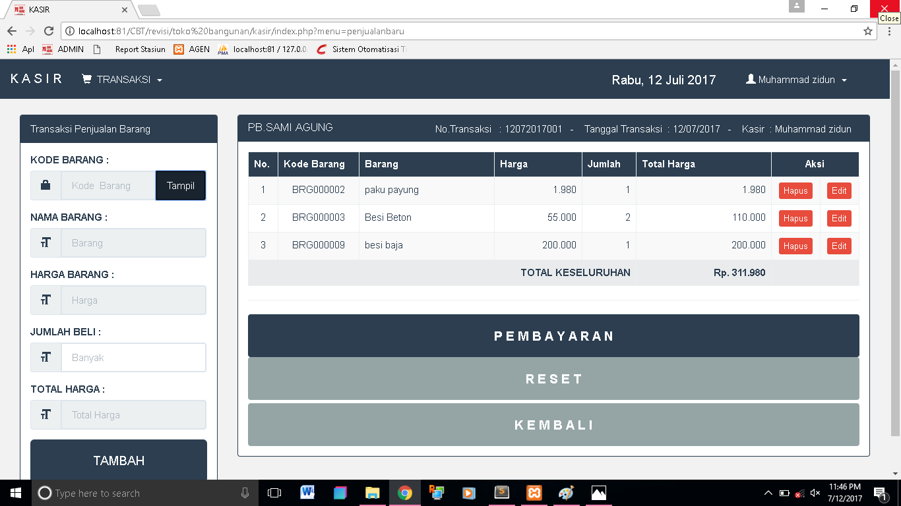
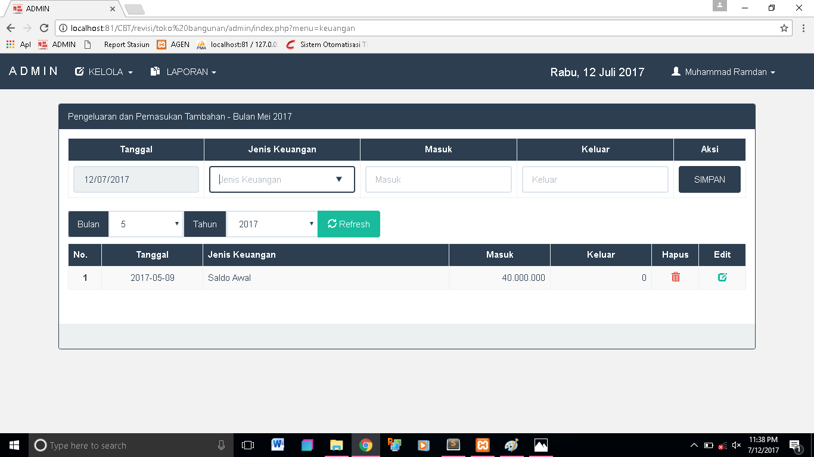

# SUDAH TIDAK DI MAINTENANCE (KALO ERROR HARAP DISAMAKAN PHP nya menggunaknan PHP 5)

# Aplikasi Pengelola Barang Toko Bangunan
Sebuah aplikasi berbasis web untuk mengelola barang dan keuangan pada sebuah toko bangunan.

## Fitur
* Dashboard

* Transaksi Pembelian Barang

* Transaksi Penjualan Barang

* Laporan Keuangan


## Teknologi
* PHP 5
* MySQL
* HTML
* CSS
* Javascript
* Bootstrap 

## Credit Developer
* [Email](mailto:programzidun@gmail.com) - programzidun@gmail.com
* [LinkedIn](https://www.linkedin.com/in/ramdanzidun/) - Muhammad Ramdan


```
Ku Coding Kau dengan Bismillah
```

